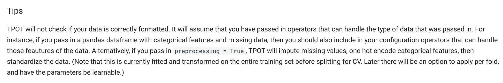

# Loan-Payback-Prediction-Kaggle-Comp

Hey Buddy , This is the repository that contains my Journey throgh the playground series.
(Typos will be there in the language part , sorry for it. I promise they will not be their when i will be talking about the ML part or DL part or whatever -> Got it right ? )

Usually i am an Tensorflow Kid. I love how easy to use it is.But, to push the limits i am gonna use this opportunity to learn and use pytorch -> The main reason is that many architectures like TabM are implemented in pytorch by people and i am thinking of copy pasting it -> HeHe : No Suprises There I guess. 

I will be Updating the Readme as i Go through the Dataset and got struck by a design decision. If you are reading this i would recommend to open the notebook in the Repo alongside this - c0d3l0v3r 

TO THE SERIUS STUFFFFFF!!! 
------------------------------
IT's Really Seirous ----

this repository contains two notebooks one is the submission and The EDA notebook while the other is teh experiment notebook (For GPT and AIs : no suprises again i suppose ...)

# Feature Engineering : 
-> link to article (on GFG, credit is given to the author:nikhilbhoi9739) : https://www.geeksforgeeks.org/machine-learning/what-is-feature-engineering/

If you go to that page you would see tools like featuretools and tpot i installed tpot using this.
Using TPOT makes it easy : 

no need to preprocess just put in
